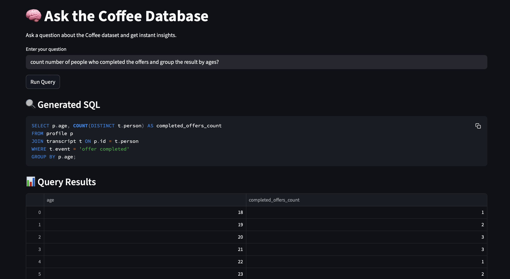

# Ask The Coffee Database ☕

An interactive **AI-powered Streamlit app** to explore and query a coffee database.
Just ask a question in plain English (e.g., *“Which coffee type has the highest sales this month?”*) and the app will:

1. Convert it into an **SQL query** using **Google Gemini**.
2. Run the query on your **SQLite coffee database**.
3. Display the results in a **Streamlit dashboard**.

---

## 🚀 Features

* 🔎 **Natural Language Queries** → Ask in plain English, get SQL automatically.
* 🗂 **SQLite Integration** → Queries run on your `coffee.db`.
* 📊 **Streamlit UI** → Clean, interactive results display.
* 🌐 **Ngrok Tunneling** → Share your app publicly from a local machine.

---

## 📦 Requirements

Install dependencies:

```bash
pip install streamlit pyngrok pandas google-generativeai
```

---

## ⚙️ Setup

1. **Clone or Download the Repo**

   ```bash
   git clone https://github.com/yourusername/ask-the-coffee-database.git
   cd ask-the-coffee-database
   ```

2. **Configure Google Gemini API Key**
   In `streamlit_app.py`, replace the placeholder with your API key:

   ```python
   genai.configure(api_key="YOUR_API_KEY")
   ```

3. **Prepare the Database**
   Make sure `coffee.db` (SQLite) exists in the project folder.
   Example tables might include:

   * `coffee` → Coffee types, sizes, categories
   * `sales` → Orders, revenue, dates
   * `customers` → Customer profiles

4. **Run the App**

   ```bash
   streamlit run streamlit_app.py
   ```

5. **Expose via Ngrok (Optional)**

   ```bash
   !ngrok config add-authtoken YOUR_TOKEN
   ```

   Then run the notebook cells in **Ask\_The\_Coffee\_Database.ipynb** to generate a public link.

---

## 🎮 How It Works

1. Enter a question:

   ```
   Show me the top 5 best-selling coffee types this month
   ```

2. Gemini generates an SQL query:

   ```sql
   SELECT coffee_type, SUM(quantity) AS total_sold
   FROM sales
   WHERE strftime('%m', date) = strftime('%m', 'now')
   GROUP BY coffee_type
   ORDER BY total_sold DESC
   LIMIT 5;
   ```

3. Streamlit displays results in a table (and can be extended with charts).

---

## 🖼 Screenshot

Here’s how the app looks when running:




---

## 📂 Project Structure

```
Ask_The_Coffee_Database.ipynb   # Jupyter notebook (setup + instructions)
streamlit_app.py                 # Streamlit app (AI-powered SQL querying)
coffee.db                        # SQLite database (not included here)
screenshot.png                   # Screenshot of running app (to be added)
```

---

## 📝 Notes

* Requires a valid **Google Gemini API key**.
* Your database schema must match the queries you want to run.
* You can extend `streamlit_app.py` to add **charts, filters, or dashboards**.

---

✨ Enjoy exploring your coffee data with the power of AI!

---


